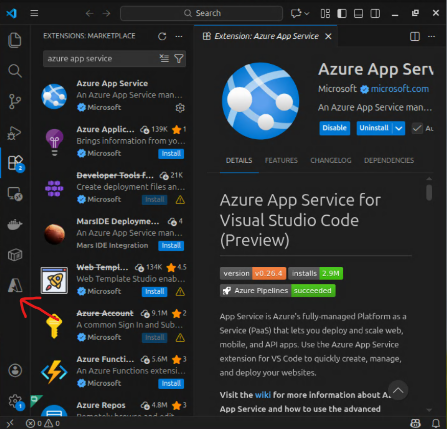
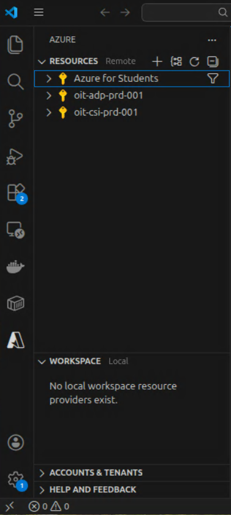

# Deliverable 1 - Tooling, Azure Setup, and Initial VM Deployment

## Objective
The purpose of this deliverable is to select and document the development tools used for this course, configure the Azure development environment on the gHost, and deploy a basic virtual server using Azure CLI.

---

## Task 1 - Select Tools

### Large Language Model (LLM)
**Selected LLM**: ChatGPT (Free Tier)  
**Justification**: I do not expect to use an LLM for this course, but if I do I will use ChatGPT. This is the only LLM I have experience with. If for some reason ChatGPT does not meet my needs, I will switch to the instructor recommendation (Claude).

### Programming Language
**Selected Language**: Python  
**Justification**: Python is widely used in cloud automation and scripting. I also taught a Python programming course last semester, so I am very familiar with it. And, this way I will be on the same page as the instructor.

### Software Development Environment
**Selected Environment**: Visual Studio Code (VSCode)  
**Justification**: VSCode supports tight integration with Azure tooling, powershell, and GitHub. Plus, using it will keep me on the same page as the instructor.

### Development Venue
**Selected Venue**: GNS3 gHost  
**Justification**: The gHost is a blank slate to develop on, which will make identifying and resolving issues more straightforward. This venue also provides support from the instructor.

### Free Azure Student Account
**Login Info**: OHIO Credentials (eb613819@ohio.edu)
- $100 credit verified.
- Azure Portal accessed.

---

## Task 2 - VSCode Development Environment Setup
- Installed the `Azure App Service` extension in VSCode by following unit 3 of [this guide](https://learn.microsoft.com/en-us/training/modules/prepare-your-dev-environment-for-azure-development/3-exercise-set-up-dev-environment?pivots=vscode).
- Signed in to Azure by clicking the `A` icon in the left toolbar -> `Sign in toAzure...`.
  
- Azure Resources are visable in the extension:
  

---

## Task 3 - Setup Powershell
**Note**: the gHost is running Ubuntu

### PowerShell Install
Installed PowerShell by doing the following:
- Update `apt-get`:
  ```bash
  sudo apt-get update
  ```
- Install prerequisite packages:
  ```bash
  sudo apt-get install -y wget apt-transport-https software-properties-common
  ```
- Set Ubuntu `$VERSION_ID` variable:
  ```bash
  source /etc/os-release
  ```
- Download the Microsoft repository keys:
  ```bash
  wget -q https://packages.microsoft.com/config/ubuntu/$VERSION_ID/packages-microsoft-prod.deb
  ```
- Register the Microsoft repository keys:
  ```bash
  sudo dpkg -i packages-microsoft-prod.deb
  ```
- Delete the Microsoft repository keys file:
  ```bash
  rm packages-microsoft-prod.deb
  ```
- Update the list of packages after adding the Microsoft repository:
  ```bash
  sudo apt-get update
  ```
- Install PowerShell:
  ```bash
  sudo apt-get install -y powershell
  ```
- Start PowerShell:
  ```bash
  pwsh
  ```
### Az Powershell Module Install
Installed the Az PowerShell module by doing the following:
- Launch PowerShell:
  ```bash
  pwsh
  ```
- Install the Az PowerShell Module:
  ```powershell
  Install-Module -Name Az -Scope CurrentUser -Repository PSGallery
  ```
- Confirm it's ok to install from an untrusted repository:
  ```powershell
  Y
  ```

### Connect to Azure
- Connected to Azure by running:
  ```powershell
  Connect-AzAccount
  ```
  Then signing in using the pop-up window.
- Select the `Azure for Students` subscription

### Changing Subscription
- Active subscription can be checked by running:
  ```powershell
  Get-AzContext
  ```
- A list of subscriptions can be shown by running (this will show Subscription ID):
  ```powershell
  Get-AzSubscription
  ```
- The active subscription can be changed by running:
  ```powershell
  Set-AzContext -Subscription '00000000-0000-0000-0000-000000000000'
  ```

### Find Allowed Resource Deployment Regions
I found allowed resource regions by going to:  
`Policy` -> `Assignments` -> `Allowed resource deployment regions`  
This is what it said:  
`["northcentralus","westus3","eastus2","southcentralus","mexicocentral"]`

### Create a Resource Group
Created a Resource Group for this class by running:
```powershell
New-AzResourceGroup -Name ITS-Cloud-Systems -Location eastus2
```

### Future Use
To reload Powershell and Login to Azure in the future:
```bash
pwsh
Connect-AzAccount
```
---

## Task 4 - Deploy a Virtual Server
I used these steps to deploy a virtual server

### Choose a Region
This command shows the available regions for the account:
```powershell
(Get-AzPolicyAssignment | 
    Where-Object {$_.DisplayName -like '*deployment*' -or $_.DisplayName -like '*Allowed resource*'}).Parameter.listOfAllowedLocations.value
```
And it output the following:
```powershell
northcentralus
westus3
eastus2
southcentralus
mexicocentral
```
I chose to use **North Central US**.

### Choose a VM size
This command shows the available sizes for the region:
```powershell
Get-AzComputeResourceSku -Location 'northcentralus' |                                                  
     Where-Object { $_.ResourceType -like 'virtualMachines'}
```
And it output the following: 
```powershell
ResourceType                 Name       Location Zones RestrictionInfo
------------                 ----       -------- ----- ---------------
virtualMachines     Standard_B1ls northcentralus       type: Location,
                                                       locations:
                                                       northcentralus
virtualMachines     Standard_B1ms northcentralus       type: Location,
                                                       locations:
                                                       northcentralus
virtualMachines      Standard_B1s northcentralus       type: Location,
                                                       locations:
                                                       northcentralus
virtualMachines Standard_B2als_v2 northcentralus       
virtualMachines  Standard_B2as_v2 northcentralus       
virtualMachines Standard_B2ats_v2 northcentralus       
virtualMachines  Standard_B2ls_v2 northcentralus       type: Location,
                                                       locations:
                                                       northcentralus
virtualMachines     Standard_B2ms northcentralus       type: Location,
                                                       locations:
                                                       northcentralus
virtualMachines Standard_B2pls_v2 northcentralus       
virtualMachines  Standard_B2ps_v2 northcentralus       
virtualMachines Standard_B2pts_v2 northcentralus       
virtualMachines      Standard_B2s northcentralus       type: Location,
                                                       locations:
                                                       northcentralus
virtualMachines   Standard_B2s_v2 northcentralus       type: Location,
                                                       locations:
                                                       northcentralus
virtualMachines  Standard_B2ts_v2 northcentralus       type: Location,
                                                       locations:
                                                       northcentralus
```
I chose to use **Standard_B2pts_v2** because that is what the rest of the class is using.

### Choose an Image
The following command will show if Canonical is available in the region:
```powershell
Get-AzVMImagePublisher -Location 'northcentralus' | Where-Object {$_.PublisherName -like '*Canonical*'}
```
And it output the following:
```powershell
PublisherName  Location       Id
-------------  --------       --
Canonical      northcentralus /Subscriptions/789db197-194a-4cca-9770-b4018e…
canonical-test northcentralus /Subscriptions/789db197-194a-4cca-9770-b4018e…
```
The following command will show disk images offered by Canonical:
```powershell
Get-AzVMImageOffer -Location 'northcentralus' -PublisherName 'Canonical'
```
And it output the following:
```powershell
Offer                                        PublisherName Location       Id
-----                                        ------------- --------       --
0001-com-ubuntu-confidential-vm-experimental Canonical     northcentralus /…
0001-com-ubuntu-confidential-vm-focal        Canonical     northcentralus /…
0001-com-ubuntu-confidential-vm-jammy        Canonical     northcentralus /…
0001-com-ubuntu-confidential-vm-tdx-jammy    Canonical     northcentralus /…
0001-com-ubuntu-minimal-bionic               Canonical     northcentralus /…
0001-com-ubuntu-minimal-focal                Canonical     northcentralus /…
0001-com-ubuntu-minimal-focal-daily          Canonical     northcentralus /…
0001-com-ubuntu-minimal-jammy                Canonical     northcentralus /…
0001-com-ubuntu-minimal-jammy-aks-daily      Canonical     northcentralus /…
0001-com-ubuntu-minimal-jammy-daily          Canonical     northcentralus /…
0001-com-ubuntu-minimal-kinetic              Canonical     northcentralus /…
0001-com-ubuntu-minimal-lunar                Canonical     northcentralus /…
0001-com-ubuntu-minimal-mantic               Canonical     northcentralus /…
0001-com-ubuntu-minimal-mantic-daily         Canonical     northcentralus /…
0001-com-ubuntu-private-fips-motorola        Canonical     northcentralus /…
0001-com-ubuntu-pro-advanced-sla             Canonical     northcentralus /…
0001-com-ubuntu-pro-advanced-sla-airdig      Canonical     northcentralus /…
0001-com-ubuntu-pro-advanced-sla-att         Canonical     northcentralus /…
0001-com-ubuntu-pro-advanced-sla-ca          Canonical     northcentralus /…
0001-com-ubuntu-pro-advanced-sla-csw         Canonical     northcentralus /…
0001-com-ubuntu-pro-advanced-sla-da          Canonical     northcentralus /…
0001-com-ubuntu-pro-advanced-sla-dd          Canonical     northcentralus /…
0001-com-ubuntu-pro-advanced-sla-nestle      Canonical     northcentralus /…
0001-com-ubuntu-pro-advanced-sla-servicenow  Canonical     northcentralus /…
0001-com-ubuntu-pro-advanced-sla-shell       Canonical     northcentralus /…
0001-com-ubuntu-pro-advanced-sla-sk          Canonical     northcentralus /…
0001-com-ubuntu-pro-advanced-sla-ub01        Canonical     northcentralus /…
0001-com-ubuntu-pro-advanced-sla-unp         Canonical     northcentralus /…
0001-com-ubuntu-pro-bionic                   Canonical     northcentralus /…
0001-com-ubuntu-pro-bionic-fips              Canonical     northcentralus /…
0001-com-ubuntu-pro-confidential-vm-jammy    Canonical     northcentralus /…
0001-com-ubuntu-pro-focal                    Canonical     northcentralus /…
0001-com-ubuntu-pro-focal-anbox              Canonical     northcentralus /…
0001-com-ubuntu-pro-focal-fips               Canonical     northcentralus /…
0001-com-ubuntu-pro-jammy                    Canonical     northcentralus /…
0001-com-ubuntu-pro-jammy-fips               Canonical     northcentralus /…
0001-com-ubuntu-pro-microsoft                Canonical     northcentralus /…
0001-com-ubuntu-pro-minimal-cis-focal        Canonical     northcentralus /…
0001-com-ubuntu-pro-minimal-cis-jammy        Canonical     northcentralus /…
0001-com-ubuntu-pro-minimal-focal            Canonical     northcentralus /…
0001-com-ubuntu-pro-trusty                   Canonical     northcentralus /…
0001-com-ubuntu-pro-xenial                   Canonical     northcentralus /…
0001-com-ubuntu-pro-xenial-fips              Canonical     northcentralus /…
0001-com-ubuntu-server-arm-preview-focal     Canonical     northcentralus /…
0001-com-ubuntu-server-eoan                  Canonical     northcentralus /…
0001-com-ubuntu-server-focal                 Canonical     northcentralus /…
0001-com-ubuntu-server-focal-daily           Canonical     northcentralus /…
0001-com-ubuntu-server-groovy                Canonical     northcentralus /…
0001-com-ubuntu-server-hirsute               Canonical     northcentralus /…
0001-com-ubuntu-server-impish                Canonical     northcentralus /…
0001-com-ubuntu-server-jammy                 Canonical     northcentralus /…
0001-com-ubuntu-server-jammy-daily           Canonical     northcentralus /…
0001-com-ubuntu-server-kinetic               Canonical     northcentralus /…
0001-com-ubuntu-server-lunar                 Canonical     northcentralus /…
0001-com-ubuntu-server-mantic                Canonical     northcentralus /…
0001-com-ubuntu-server-mantic-daily          Canonical     northcentralus /…
0002-com-ubuntu-minimal-disco-daily          Canonical     northcentralus /…
0002-com-ubuntu-minimal-focal-daily          Canonical     northcentralus /…
test-ubuntu-premium-offer-0002               Canonical     northcentralus /…
ubuntu                                       Canonical     northcentralus /…
ubuntu-22_04-lts                             Canonical     northcentralus /…
ubuntu-22_04-lts-daily                       Canonical     northcentralus /…
ubuntu-24_04-lts                             Canonical     northcentralus /…
ubuntu-24_04-lts-daily                       Canonical     northcentralus /…
ubuntu-24_10                                 Canonical     northcentralus /…
ubuntu-24_10-daily                           Canonical     northcentralus /…
ubuntu-25_04                                 Canonical     northcentralus /…
ubuntu-25_04-daily                           Canonical     northcentralus /…
ubuntu-25_10                                 Canonical     northcentralus /…
ubuntu-25_10-daily                           Canonical     northcentralus /…
ubuntu-26_04-lts-daily                       Canonical     northcentralus /…
ubuntu-core-24-private                       Canonical     northcentralus /…
ubuntu-pro-infra-and-apps-24x7-support       Canonical     northcentralus /…
Ubuntu15.04Snappy                            Canonical     northcentralus /…
Ubuntu15.04SnappyDocker                      Canonical     northcentralus /…
UbunturollingSnappy                          Canonical     northcentralus /…
UbuntuServer                                 Canonical     northcentralus /…
```
I will use **`Canonical:ubuntu-24_04-lts:server:latest`** because that is what the class is using, and to keep using the latest release.

