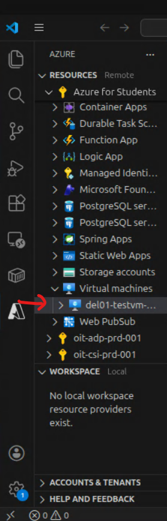
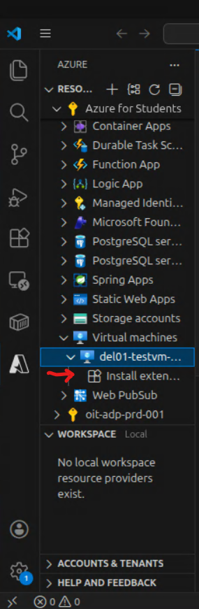
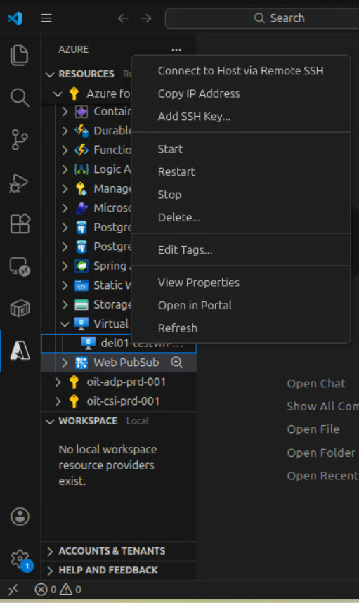

# Deliverable 1 - Tooling, Azure Setup, and Initial VM Deployment

## Objective
The purpose of this deliverable is to select and document the development tools used for this course, configure the Azure development environment on the gHost, and deploy a basic virtual server using Azure CLI.

---

## Table of Contents
- [Objective](#objective)
- [Task 1 – Select Tools](#task-1)
  - [Large Language Model (LLM)](#large-language-model-llm)
  - [Programming Language](#programming-language)
  - [Software Development Environment](#software-development-environment)
  - [Development Venue](#development-venue)
  - [Free Azure Student Account](#free-azure-student-account)
- [Task 2 – VSCode Development Environment Setup](#task-2)
- [Task 3 – Setup PowerShell](#task-3)
  - [PowerShell Install](#powershell-install)
  - [Az PowerShell Module Install](#az-powershell-module-install)
  - [Connect to Azure](#connect-to-azure)
  - [Create a Resource Group](#create-a-resource-group)
- [Task 4 – Deploy a Virtual Server](#task-4)
  - [Choose a Region](#choose-a-region)
  - [Choose a VM Size](#choose-a-vm-size)
  - [Choose an Image](#choose-an-image)
  - [The Configuration](#the-configuration)
  - [Execute the Configuration](#execute-the-configuration)
  - [SSH Into VM](#ssh-into-vm)
  - [VM in VSCode Extension](#vm-in-vscode-extension)
  - [Cleanup the VM](#cleanup-the-vm)
  - [Problems Deploying](#problems-deploying)
- [SKU-Region Script](#sku-region-script)

---

<a id="task-1"></a>
## Task 1 - Select Tools

### Large Language Model (LLM)
**Selected LLM**: ChatGPT (Free Tier)  
**Justification**: I do not expect to use an LLM for this course, but if I do I will use ChatGPT. This is the LLM I have experience with and I do not want to introduce friction by switching tools when not necessary.


### Programming Language
**Selected Language**: Python and PowerShell  
**Justification**: Python will be used for data processing and orchestration. I have taught a Python programming course, so I am very familiar with it. And, this way I will be on the same page as the instructor. PowerShell will be used for interacting directly with Azure, since it has native support and tight integration with Azure services.


### Software Development Environment
**Selected Environment**: Visual Studio Code (VSCode)  
**Justification**: VSCode supports tight integration with Azure tooling, powershell, and GitHub. Plus, using it will keep me on the same page as the instructor.


### Development Venue
**Selected Venue**: GNS3 gHost  
**Justification**: The gHost is a blank slate to develop on, which will make identifying and resolving issues more straightforward. This venue also provides support from the instructor.


### Free Azure Student Account
**Login Info**: Azure for Students via OHIO credentials
- $100 credit verified.
- Azure Portal accessed.


---

<a id="task-2"></a>
## Task 2 - VSCode Development Environment Setup
- Installed the `Azure App Service` extension in VSCode by following unit 3 of [this guide](https://learn.microsoft.com/en-us/training/modules/prepare-your-dev-environment-for-azure-development/3-exercise-set-up-dev-environment?pivots=vscode).
- Signed in to Azure by clicking the `A` icon in the left toolbar -> `Sign in toAzure...`.  
  
- Azure Resources are visable in the extension:  
  


---

<a id="task-3"></a>
## Task 3 - Setup Powershell
**Note**: the gHost is running Ubuntu

### PowerShell Install
Installed PowerShell by doing the following:
- Update `apt-get`:
  ```bash
  sudo apt-get update
  ```
- Install prerequisite packages:
  ```bash
  sudo apt-get install -y wget apt-transport-https software-properties-common
  ```
- Set Ubuntu `$VERSION_ID` variable:
  ```bash
  source /etc/os-release
  ```
- Download the Microsoft repository keys:
  ```bash
  wget -q https://packages.microsoft.com/config/ubuntu/$VERSION_ID/packages-microsoft-prod.deb
  ```
- Register the Microsoft repository keys:
  ```bash
  sudo dpkg -i packages-microsoft-prod.deb
  ```
- Delete the Microsoft repository keys file:
  ```bash
  rm packages-microsoft-prod.deb
  ```
- Update the list of packages after adding the Microsoft repository:
  ```bash
  sudo apt-get update
  ```
- Install PowerShell:
  ```bash
  sudo apt-get install -y powershell
  ```
- Start PowerShell:
  ```bash
  pwsh
  ```


### Az Powershell Module Install
Installed the Az PowerShell module by doing the following:
- Launch PowerShell:
  ```bash
  pwsh
  ```
- Install the Az PowerShell Module:
  ```powershell
  Install-Module -Name Az -Scope CurrentUser -Repository PSGallery
  ```
- Confirm it's ok to install from an untrusted repository:
  ```powershell
  Y
  ```


### Connect to Azure
- Connected to Azure by running:
  ```powershell
  Connect-AzAccount
  ```
  Then signing in using the pop-up window.
- Select the `Azure for Students` subscription


### Changing Subscription
- Active subscription can be checked by running:
  ```powershell
  Get-AzContext
  ```
- A list of subscriptions can be shown by running (this will show Subscription ID):
  ```powershell
  Get-AzSubscription
  ```
- The active subscription can be changed by running:
  ```powershell
  Set-AzContext -Subscription '00000000-0000-0000-0000-000000000000'
  ```


### Find Allowed Resource Deployment Regions
I found allowed resource regions by going to:  
`Policy` -> `Assignments` -> `Allowed resource deployment regions`  
This is what it said:  
`["northcentralus","westus3","eastus2","southcentralus","mexicocentral"]`


### Create a Resource Group
Created a Resource Group for this class by running:
```powershell
New-AzResourceGroup -Name ITS-Cloud-Systems -Location northcentralus
```


### Future Use
To reload Powershell and Login to Azure in the future:
```bash
pwsh
Connect-AzAccount
```


---

<a id="task-4"></a>
## Task 4 - Deploy a Virtual Server
I used these steps to deploy a virtual server

### Choose a Region
This command shows the available regions for the account:
```powershell
(Get-AzPolicyAssignment | 
    Where-Object {$_.DisplayName -like '*deployment*' -or $_.DisplayName -like '*Allowed resource*'}).Parameter.listOfAllowedLocations.value
```

And it output the following:
```powershell
northcentralus
westus3
eastus2
southcentralus
mexicocentral
```

I chose to use **North Central US** because it is available for the subscription and supports required free-tier VM sizes.

### Choose a VM size
This command shows all sizes for the region:
```powershell
Get-AzComputeResourceSku -Location 'northcentralus' |                                                  
     Where-Object { $_.ResourceType -like 'virtualMachines'}
```
The list this returns is very long. We will be using the `Standard_B` size for this class, so I used this command instead:
```powershell
Get-AzComputeResourceSku -Location 'northcentralus' |                                                  
     Where-Object {$_.Name -like 'Standard_B[12][a-z]*'} |
     Format-Table -Wrap -AutoSize
```
And it output the following: 
```powershell
ResourceType                 Name       Location Zones RestrictionInfo
------------                 ----       -------- ----- ---------------
virtualMachines     Standard_B1ls northcentralus       type: Location,
                                                       locations:
                                                       northcentralus
virtualMachines     Standard_B1ms northcentralus       type: Location,
                                                       locations:
                                                       northcentralus
virtualMachines      Standard_B1s northcentralus       type: Location,
                                                       locations:
                                                       northcentralus
virtualMachines Standard_B2als_v2 northcentralus       
virtualMachines  Standard_B2as_v2 northcentralus       
virtualMachines Standard_B2ats_v2 northcentralus       
virtualMachines  Standard_B2ls_v2 northcentralus       type: Location,
                                                       locations:
                                                       northcentralus
virtualMachines     Standard_B2ms northcentralus       type: Location,
                                                       locations:
                                                       northcentralus
virtualMachines Standard_B2pls_v2 northcentralus       
virtualMachines  Standard_B2ps_v2 northcentralus       
virtualMachines Standard_B2pts_v2 northcentralus       
virtualMachines      Standard_B2s northcentralus       type: Location,
                                                       locations:
                                                       northcentralus
virtualMachines   Standard_B2s_v2 northcentralus       type: Location,
                                                       locations:
                                                       northcentralus
virtualMachines  Standard_B2ts_v2 northcentralus       type: Location,
                                                       locations:
                                                       northcentralus
```

I chose to use **Standard_B2ats_v2** because it is available with the free tier and it supports x64 architecture.


### Choose an Image
The following command will show if Canonical is available in the region:
```powershell
Get-AzVMImagePublisher -Location 'northcentralus' | Where-Object {$_.PublisherName -like '*Canonical*'}
```

And it output the following:
```powershell
PublisherName  Location       Id
-------------  --------       --
Canonical      northcentralus /Subscriptions/789db197-194a-4cca-9770-b4018e…
canonical-test northcentralus /Subscriptions/789db197-194a-4cca-9770-b4018e…
```

The following command will show disk images offered by Canonical:
```powershell
Get-AzVMImageOffer -Location 'northcentralus' -PublisherName 'Canonical'
```

And it output the following:
```powershell
Offer                                        PublisherName Location       Id
-----                                        ------------- --------       --
0001-com-ubuntu-confidential-vm-experimental Canonical     northcentralus /…
0001-com-ubuntu-confidential-vm-focal        Canonical     northcentralus /…
0001-com-ubuntu-confidential-vm-jammy        Canonical     northcentralus /…
0001-com-ubuntu-confidential-vm-tdx-jammy    Canonical     northcentralus /…
0001-com-ubuntu-minimal-bionic               Canonical     northcentralus /…
0001-com-ubuntu-minimal-focal                Canonical     northcentralus /…
0001-com-ubuntu-minimal-focal-daily          Canonical     northcentralus /…
0001-com-ubuntu-minimal-jammy                Canonical     northcentralus /…
0001-com-ubuntu-minimal-jammy-aks-daily      Canonical     northcentralus /…
0001-com-ubuntu-minimal-jammy-daily          Canonical     northcentralus /…
0001-com-ubuntu-minimal-kinetic              Canonical     northcentralus /…
0001-com-ubuntu-minimal-lunar                Canonical     northcentralus /…
0001-com-ubuntu-minimal-mantic               Canonical     northcentralus /…
0001-com-ubuntu-minimal-mantic-daily         Canonical     northcentralus /…
0001-com-ubuntu-private-fips-motorola        Canonical     northcentralus /…
0001-com-ubuntu-pro-advanced-sla             Canonical     northcentralus /…
0001-com-ubuntu-pro-advanced-sla-airdig      Canonical     northcentralus /…
0001-com-ubuntu-pro-advanced-sla-att         Canonical     northcentralus /…
0001-com-ubuntu-pro-advanced-sla-ca          Canonical     northcentralus /…
0001-com-ubuntu-pro-advanced-sla-csw         Canonical     northcentralus /…
0001-com-ubuntu-pro-advanced-sla-da          Canonical     northcentralus /…
0001-com-ubuntu-pro-advanced-sla-dd          Canonical     northcentralus /…
0001-com-ubuntu-pro-advanced-sla-nestle      Canonical     northcentralus /…
0001-com-ubuntu-pro-advanced-sla-servicenow  Canonical     northcentralus /…
0001-com-ubuntu-pro-advanced-sla-shell       Canonical     northcentralus /…
0001-com-ubuntu-pro-advanced-sla-sk          Canonical     northcentralus /…
0001-com-ubuntu-pro-advanced-sla-ub01        Canonical     northcentralus /…
0001-com-ubuntu-pro-advanced-sla-unp         Canonical     northcentralus /…
0001-com-ubuntu-pro-bionic                   Canonical     northcentralus /…
0001-com-ubuntu-pro-bionic-fips              Canonical     northcentralus /…
0001-com-ubuntu-pro-confidential-vm-jammy    Canonical     northcentralus /…
0001-com-ubuntu-pro-focal                    Canonical     northcentralus /…
0001-com-ubuntu-pro-focal-anbox              Canonical     northcentralus /…
0001-com-ubuntu-pro-focal-fips               Canonical     northcentralus /…
0001-com-ubuntu-pro-jammy                    Canonical     northcentralus /…
0001-com-ubuntu-pro-jammy-fips               Canonical     northcentralus /…
0001-com-ubuntu-pro-microsoft                Canonical     northcentralus /…
0001-com-ubuntu-pro-minimal-cis-focal        Canonical     northcentralus /…
0001-com-ubuntu-pro-minimal-cis-jammy        Canonical     northcentralus /…
0001-com-ubuntu-pro-minimal-focal            Canonical     northcentralus /…
0001-com-ubuntu-pro-trusty                   Canonical     northcentralus /…
0001-com-ubuntu-pro-xenial                   Canonical     northcentralus /…
0001-com-ubuntu-pro-xenial-fips              Canonical     northcentralus /…
0001-com-ubuntu-server-arm-preview-focal     Canonical     northcentralus /…
0001-com-ubuntu-server-eoan                  Canonical     northcentralus /…
0001-com-ubuntu-server-focal                 Canonical     northcentralus /…
0001-com-ubuntu-server-focal-daily           Canonical     northcentralus /…
0001-com-ubuntu-server-groovy                Canonical     northcentralus /…
0001-com-ubuntu-server-hirsute               Canonical     northcentralus /…
0001-com-ubuntu-server-impish                Canonical     northcentralus /…
0001-com-ubuntu-server-jammy                 Canonical     northcentralus /…
0001-com-ubuntu-server-jammy-daily           Canonical     northcentralus /…
0001-com-ubuntu-server-kinetic               Canonical     northcentralus /…
0001-com-ubuntu-server-lunar                 Canonical     northcentralus /…
0001-com-ubuntu-server-mantic                Canonical     northcentralus /…
0001-com-ubuntu-server-mantic-daily          Canonical     northcentralus /…
0002-com-ubuntu-minimal-disco-daily          Canonical     northcentralus /…
0002-com-ubuntu-minimal-focal-daily          Canonical     northcentralus /…
test-ubuntu-premium-offer-0002               Canonical     northcentralus /…
ubuntu                                       Canonical     northcentralus /…
ubuntu-22_04-lts                             Canonical     northcentralus /…
ubuntu-22_04-lts-daily                       Canonical     northcentralus /…
ubuntu-24_04-lts                             Canonical     northcentralus /…
ubuntu-24_04-lts-daily                       Canonical     northcentralus /…
ubuntu-24_10                                 Canonical     northcentralus /…
ubuntu-24_10-daily                           Canonical     northcentralus /…
ubuntu-25_04                                 Canonical     northcentralus /…
ubuntu-25_04-daily                           Canonical     northcentralus /…
ubuntu-25_10                                 Canonical     northcentralus /…
ubuntu-25_10-daily                           Canonical     northcentralus /…
ubuntu-26_04-lts-daily                       Canonical     northcentralus /…
ubuntu-core-24-private                       Canonical     northcentralus /…
ubuntu-pro-infra-and-apps-24x7-support       Canonical     northcentralus /…
Ubuntu15.04Snappy                            Canonical     northcentralus /…
Ubuntu15.04SnappyDocker                      Canonical     northcentralus /…
UbunturollingSnappy                          Canonical     northcentralus /…
UbuntuServer                                 Canonical     northcentralus /…
```

I will use **`Canonical:ubuntu-24_04-lts:server:latest`** because that is what the class is using, and to keep using the latest release.


### The Configuration
The following is the configuration for deploying the server:
```powershell
$azVmParams = @{
    ResourceGroupName   = 'ITS-Cloud-Systems'
    Name                = 'del01-testvm-ncus-01'
    Credential          = (Get-Credential)
    Location            = 'northcentralus'
    Image               = 'Canonical:ubuntu-24_04-lts:server:latest'
    Size                = 'Standard_B2ats_v2'
    OpenPorts           = 22
    PublicIpAddressName = 'del01-testvm-ncus-0101'
}
```

Where 
- **`ResourceGroupName`** must match the [Resource Group](#create-a-resource-group) created earlier
- **`Name`** is just a name I chose that stands for `deliverable01-testvm-northcentralus-01`
- **`(Get-Credential)`** runs the PS command `Get-Credential` which prompts the user for input and then places the responses into the variable to be used later in the process. **Note**: the password must be between 6-72 characters long and must satisfy at least 3 of password complexity requirements from the following:
1) Contains an uppercase character                                           
2) Contains a lowercase character                                            
3) Contains a numeric digit                                                  
4) Contains a special character                                              
5) Control characters are not allowed
- **`Location`** is the [region](#choose-a-region) chosen earlier
- **`Image`** is the [image](#choose-an-image) chosen earlier
-  **`Size`** is the [size](#choose-a-vm-size) chosen earlier
-  **`OpenPorts`** is the ports to leave open
-  **`PublicIpAddressName`** is the name of the IP Address


### Execute the configuration
The following command executes the [configuration](#the-configuration):
```powershell
New-AzVm @azVmParams
```

The command will return this with the previous [configuration](#the-configuration):
```powershell
ResourceGroupName        : ITS-Cloud-Systems                                 
Id                       : /subscriptions/789db197-194a-4cca-9770-b4018ed723 
a8/resourceGroups/ITS-Cloud-Systems/providers/Microsoft.Compute/virtualMachi 
nes/del01-testvm-ncus-01                                                     
VmId                     : 47ad1ff7-3c9b-4a65-8de2-fb6cd4c4e065              
Name                     : del01-testvm-ncus-01                              
Type                     : Microsoft.Compute/virtualMachines                 
Location                 : northcentralus                                    
Tags                     : {}                                                
HardwareProfile          : {VmSize}                                          
NetworkProfile           : {NetworkInterfaces}                               
OSProfile                : {ComputerName, AdminUsername,                     
LinuxConfiguration, Secrets, AllowExtensionOperations,                       
RequireGuestProvisionSignal}                                                 
ProvisioningState        : Succeeded                                         
StorageProfile           : {ImageReference, OsDisk, DataDisks,               
DiskControllerType, AlignRegionalDisksToVMZone}                              
FullyQualifiedDomainName :                                                   
del01-testvm-ncus-01-9721c2.northcentralus.cloudapp.azure.com                
TimeCreated              : 1/21/2026 2:39:39 PM                              
Etag                     : "2"
```


### SSH Into VM
I SSH'd into the VM by doing the following:
- Get the IP address using the `PublicIpAddressName` from the [configuration](#the-configuration):
  ```powershell
  Get-AzPublicIpAddress -ResourceGroupName 'ITS-Cloud-Systems' -Name 'del01-testvm-ncus-0101'
  ```
  Which returns:
  ```powershell
  ResourceGroupName Name                   Location       PublicIpAllocationMethod IpAddress      PublicIpAddressVersion IdleTimeoutInMinutes ProvisioningState
  ----------------- ----                   --------       ------------------------ ---------      ---------------------- -------------------- ----------
  ITS-Cloud-Systems del01-testvm-ncus-0101 northcentralus Static                   172.183.87.166 IPv4                   4                    Succeeded 
  ```
- SSH into the machine using the credentials from [running the configuration](#execute-the-configuration):
  ```powershell
  ssh its@172.183.87.166
  ```
- If successful the VM bash will show:
  ```bash
  itsvm@del01-testvm-ncus-01:~$
  ```
  
  
### VM in VSCode Extension
In the VSCode Azure extension, the VM should show up:  


The VM can be manipulated via VSCode by using the `Install Extension` link under the VM:  


This is after I installed it:  



### Cleanup the VM
This command cleans up the VM:
```powershell
Remove-AzVM -ResourceGroupName 'ITS-Cloud-Systems' -Name 'del01-testvm-ncus-01' -Force
```

And will output something like:
```powershell
OperationId : cfa55967-74c3-471c-8e3e-9992f3b939a5
Status      : Succeeded
StartTime   : 1/21/2026 10:10:04 AM
EndTime     : 1/21/2026 10:10:45 AM
Error       :
```

### Problems Deploying
When I attempted to deply the image **`Canonical:ubuntu-24_04-lts:server:latest`** on size **`Standard_B2pts_v2`**, I encountered this architecture mismatch error:
```powershell
New-AzVM: Cannot create a VM of size 'Standard_B2pts_v2' because this VM size only supports a CPU Architecture of 'Arm64', but an image or disk with CPU Architecture 'x64' was given. Please check that the CPU Architecture of the image or disk is compatible with that of the VM size.
```
[Here](https://learn.microsoft.com/en-us/azure/virtual-machines/sizes/overview?tabs=breakdownseries%2Cgeneralsizelist%2Ccomputesizelist%2Cmemorysizelist%2Cstoragesizelist%2Cgpusizelist%2Cfpgasizelist%2Chpcsizelist) it shows that the `p` in `Standard_B2pts_v2` means its an ARM based CPU, while an `a` means its an AMD CPU.
My solution was to use size **`Standard_B2ats_v2`** instead.

## SKU-Region Script
During VM deployment, determining which VM sizes are actually usable for a given
subscription and region can be non-trivial due to Azure policy restrictions,
zone limitations, and architecture compatibility.

To address this, I developed a custom **SKU discovery script**
located in the `scripts/` directory.

### Purpose

The script was created to:
- Identify VM SKUs that are **allowed by Azure policy**
- Detect **region-level and zone-level restrictions**
- Surface key hardware characteristics such as:
  - CPU architecture
  - vCPU count
  - Memory size
  - OS disk size limits
- Avoid trial-and-error failures during VM deployment

### Implementation Overview

The solution consists of two parts:

1.) **PowerShell (`get_vm_skus.ps1`)**
  - Queries Azure using the Az PowerShell module
  - Collects user account locations, VM SKU availability, zones, restrictions, and capabilities
  - Outputs the results as structured JSON

2.) **Python (`get_vm_skus.py`)**
  - Executes the PowerShell script
  - Displays a loading indicator while data is collected
  - Presents the results in an interactive, arrow-key-driven CLI
  - Allows filtering by location, family, tier, and CPU architecture

### Usage & Setup

Detailed setup instructions, Python environment configuration, and example usage
are documented here: **[`scripts/README.md`](scripts/README.md)**
