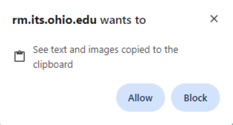
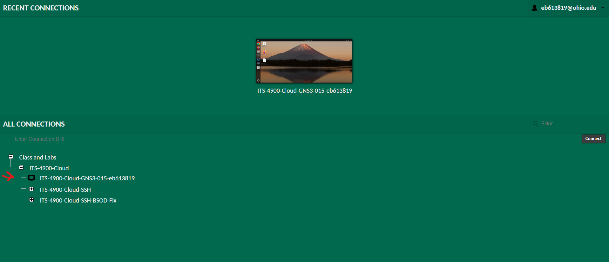
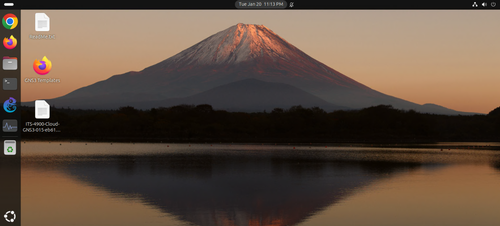
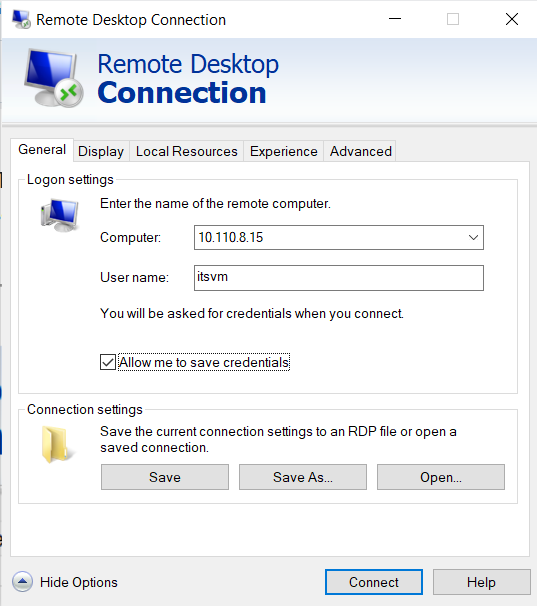

# Pre Deliverable Setup

## Objective
Establish access to the gHost environment and configure it for use.
This includes connecting via Remote Desktop and SSH, authenticating with GitHub, and preparing VSCode.

---

## gHost Access
**Hostname**: `ITS-4900-Cloud-GNS3-015-eb613819`\
**Private IP**: `10.110.8.15`\
**Username**: `itsvm`

**Note**: Do not shut down the gHost.

### Guacamole Web Interface

#### GUI Connection
Connected to the gHost using Guacamole by following these steps:
1. Go to `https://rm.its.ohio.edu/`
2. Allow Guacamole to use the clipboard (pop-up if on Chrome)
   
4. Login to OHIO account
5. Click `Class and Labs` -> `ITS-4900-Cloud` -> `ITS-4900-Cloud-GNS3-015-eb613819`
   
7. If successful, this appears:
   

#### CLI Connection
Going to `Class and Labs` -> `ITS-4900-Cloud` -> `ITS-4900-Cloud-SSH` -> `ITS-4900-Cloud-GNS3-015-eb613819-SSH` will open a CLI (SSH) interface.

#### Black Screen of Death (BSOD)
To fix the BSOD, go to `Class and Labs` -> `ITS-4900-Cloud` -> `ITS-4900-Cloud-SSH-BSOD-Fix` -> `ITS-4900-Cloud-GNS3-015-eb613819-SSH-BSOD-Fix` and run the command.

### Remote Desktop
Connected to the gHost using Remote Desktop by following these steps:
1. Open `Remote Desktop Connection`
2. Configure RD Gateway in `Show Options` -> `Advanced` -> `Connect from anywhere` -> `Settings`
3. Use these inputs (After configuring the RD Gateway):

4. It will then prompt for a password.

### SSH
Attempted to connect via SSH using a jumphost:
```bash
ssh -J eb613819@<jumphost_ip> itsvm@10.110.8.15
```
**Note** My credentials did not work on the jumphost. I will be reaching out to Brandon, but probably will not be using this method anyway.

---

## GitHub

### Account
I have a previously existing account:
`GitHub ID: eb613819`
This account has been emailed to Professor Brandon Saunders.

### Authentication
I was able to authenticate on the gHost by following these steps (after getting the keyring password from Brandon):
1. Install the CLI tool:
   ```bash
   sudo apt install -y gh
   ```
2. Setup authentication with the CLI tool (Select `GitHub.com` -> `HTTPS` -> `Y` -> `Login with a web browser`:
   ```bash
   gh auth login
   ```
3. Configure Git user info:
   ```bash
   git config --global user.email "eb613819"
   git config --global user.name "Evan Brooks"
   ```
4. Confirm it worked:
   ```bash
   gh repo view OHIO-ECT/Lab-Notebook-Cheat-Sheet
   ```
   
---

## VSCode
- Launched VSCode on the gHost
- Pinned VSCode to the start bar
